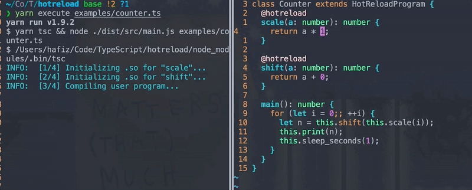
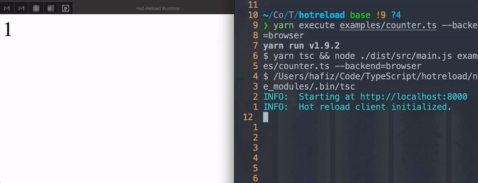

# hotreload

This is a small framework for program execution with support for [hot code reloading](https://en.wikipedia.org/wiki/Dynamic_software_updating).
There are two backends - one that compiles and runs machine code, and one that
runs JavaScript in a browser.

<!-- START doctoc generated TOC please keep comment here to allow auto update -->
<!-- DON'T EDIT THIS SECTION, INSTEAD RE-RUN doctoc TO UPDATE -->

- [Usage](#usage)
- [A summary of the framework language](#a-summary-of-the-framework-language)
- [The Native Backend and Runtime](#the-native-backend-and-runtime)
  - [Generated C++ code](#generated-c-code)
  - [Choosing a C++ compiler](#choosing-a-c-compiler)
- [The Browser Backend and Runtime](#the-browser-backend-and-runtime)

<!-- END doctoc generated TOC please keep comment here to allow auto update -->

Hot code reloading allows you to edit the source(s) of a software and view the
impact of your edits real-time in a running program. For development this is a
huge boon, as you get to see changes immediately without having to go through a
lengthy recompile or having to re-navigate to the state your program was in
before you made the edit. For examples, see the sections on backends below or
the [examples/](./examples) directory.

The framework provided by this repository is exploratory in nature, as a
demonstration of how you _could_ implement this in a production system.

The framework language is a DSL written in TypeScript. The framework supports
two backend/runtimes for hot-code reloading: a
[native backend and runtime](#the-native-backend-and-runtime) that compiles generated C++ code, and a
[browser backend and runtime](#the-brower-backend-and-runtime) that runs transpiled JS code.

## Usage

First, make sure you do `yarn install` or similar with your favorite package
manager.

`npm execute`/`yarn execute` (i.e. the `execute` script in the [`package.json`](./package.json))
is the entry point to the framework compiler/runtime execution of a program.
This must be run from the root of the repository! (At least until I fixup usage
of relative paths in the framework, which will probably never happen).

To run a single program, do `yarn execute <program.ts>`. For example, `yarn execute examples/counter.ts` runs [this example](./examples/counter.ts).

By default, the native backend is targeted. Use `yarn execute --help` to see
other options.

## A summary of the framework language

The framework front-end is a DSL in the TypeScript programming language; an [example
program](./examples/counter.ts) is

```typescript
class Counter extends HotReloadProgram {
  @hotreload
  scale(a: number): number {
    return a * 1;
  }

  @hotreload
  shift(a: number): number {
    return a + 0;
  }

  main(): number {
    for (let i = 0; ; ++i) {
      let n = this.shift(this.scale(i));
      this.print(n);
      this.sleep_seconds(1);
    }
  }
}
```

A program file consists of a single TypeScript file with a single class that
extends from `HotReloadProgram`. The program entry point is the `main` function
of that class. Functions that are marked `@hotreload` will be watched for
changes by the runtime, and automatically be updated in the active state of the
program. See the below sections on runtimes and backends for information on how
this works.

The browser backend permits all valid TypeScript code; the native backend is
more constrained (see its section below for more details). The framework
"compiler" validates that the program is admissible into the runtime by linking
against the [runtime library](./runtime/runtime.d.ts); if you include that
library in your editor's `tsconfig.json` settings, your editor's TS language
service (if you have one) will be initialized in a manner that is cognizant of
the runtime definitions. The `tsconfig.json` in the [examples/](./examples)
directory is already set up to admit programs in this framework language; you
may wish to write sample programs directly in that directory.

## The Native Backend and Runtime

First, let's take a look at an example:



Clearly the running machine code is changing as we edit the source, but notice
that the state of `i` in the counter persists -- this is no live code reloading.
We are hot-swapping only the changed implementation on the fly.

So what's happening here? When targetting the native backend, the framework does
the following:

1. The input program is "compiled" (okay, it's pretty much just direct translation)
   to C++ code admissible by the [program C++ runtime](./runtime/runtime.cpp)
2. This generated C++ code is passed to the [framework native runtime](./src/runtime_native.ts)
   which
   - Allocates implementation, object, and lockfiles for functions annotated
     with `@hotreload`. These functions are compiled to shared objects and
     read lazily, on-demand by the [program C++ runtime](./runtime/runtime.cpp).
   - Constructs a total C++ program by prepending the program runtime to the
     generated C++ code.
   - Compiles the total C++ program to machine code.
   - Executes the total program machine code.
3. The [framework native runtime](./src/runtime_native.ts) now watches the input
   program for content changes. When a change to a `@hotreload` function is
   detected, the framework runtime rewrites the C++ implementation of that
   function and recompiles the shared object associated with that function.
   - Because this shared object is unique for each `@hotreload` function,
     recompilation is fast and does not affect the running state of the main
     program.
   - If there are any compilation errors, the framework runtime backs off,
     informs the user of errors, and continues as if nothing had changed.
4. The [program C++ runtime](./runtime/runtime.cpp) keeps track of modifications
   to the shared objects assocaited with `@hotreload` functions. Information on
   where these shared objects are and the functions they expose are populated
   during code generation by the framework runtime. When a `@hotreload` function
   is called by the running C++ program, the C++ runtime checks if there have
   been any changes to the associated shared object, reloads it as needed, and
   extracts the cached function handler for the call.
   - Lazy-loading of shared objects only on calls and caching of loaded
     function handlers prevents excessive work in the program runtime, and
     keeps the program's behavior closer to that of what it normally would be
     without a runtime overhead for hot code reloading.

Note that there is nothing very novel or tricky about this. Dynamic (runtime)
linking is a well-known idea, the basis for pretty much every plugin
architecture, and the reason `dlopen` and friends exist. The more interesting
part (in my opinion) is writting a framework and runtime that can naturally
translate annotations in a high-level language to dynamic loading/unloading of
libraries, for which we present one approach here.

### Generated C++ code

Although it is generally not exposed to the user, the generated C++ code can be
viewed before its compilation and execution by passing `--show-generated`.
Running the [counter example](./examples/counter.ts) with the native backend and
this flag gives

```cpp
INFO:  Generated C++ code:
INFO:  // /private/var/folders/_j/4xdvs8jj5qd6nsfk8wf6jy900000gn/T/7f828395e1611cb8b3e64ee8c7536f35.cpp
INFO:  extern "C" int scale(int a) {
INFO:    return a * 1;
INFO:  }
INFO:
INFO:  // /private/var/folders/_j/4xdvs8jj5qd6nsfk8wf6jy900000gn/T/2872612167e7943ceea64b36d17c89d4.cpp
INFO:  extern "C" int shift(int a) {
INFO:    return a + 0;
INFO:  }
INFO:
INFO:  // /private/var/folders/_j/4xdvs8jj5qd6nsfk8wf6jy900000gn/T/fc2d242f0363b851a0b2efd6b9db7df8.cpp
INFO:  /* <runtime snipped> */
INFO:  HotReload<int(int)> scale("scale", "/private/var/folders/_j/4xdvs8jj5qd6nsfk8wf6jy900000gn/T/40d1e496db6a6655b65c5d73458b6373", "/private/var/folders/_j/4xdvs8jj5qd6nsfk8wf6jy900000gn/T/2d8885948a7d8c9abf321e4f3f6912c1", "/private/var/folders/_j/4xdvs8jj5qd6nsfk8wf6jy900000gn/T/ef5a9921ce0030c42054ec3fb658b3ad");
INFO:  HotReload<int(int)> shift("shift", "/private/var/folders/_j/4xdvs8jj5qd6nsfk8wf6jy900000gn/T/fad7d0510a897b50c8f8aec4efc8155e", "/private/var/folders/_j/4xdvs8jj5qd6nsfk8wf6jy900000gn/T/d02eecf94ddeb3592470ff6959fdcaba", "/private/var/folders/_j/4xdvs8jj5qd6nsfk8wf6jy900000gn/T/f3176b0204c187f47b4d0f1cef1a5e37");
INFO:  int main() {
INFO:    for (auto i = 0; ; ++i) {
INFO:      auto n = shift.get()(scale.get()(i));
INFO:      print(n);
INFO:      sleep_seconds(1);
INFO:    }
INFO:  }
```

As you can see, the code generation is very straightforward - it's mostly just
lifting functions out of the `Program` class and rewriting
`@hotreload`-annotated functions.

Because I don't want this project to be about TS->C++ translation, only a small
subset of the TS language can be translated to C++ (methods, while blocks,
expression statements, numbers, and function calls). The framework will issue
errors for things it doesn't know how to translate. If you want to add more
translation features, you can do so in the [`CppCodeGenerator` class in the
compiler](./src/compile.ts) -- it should be very straightforward.

### Choosing a C++ compiler

The framework reads the `CXX` environment variable to find the C++ compiler to
use. If this is unset, `c++` is used.

## The Browser Backend and Runtime

As with the native backend, it's helpful to first take a look at an example:



This is no live code reloading. The counter doesn't reset when we [change the
code](./examples/counter.ts), but rather the implementations of `scale` and
`shift` are hot-swapped on the fly.

When targetting the browser backend, the work the framework does is similar to
that done in the native backend, but is a bit simpler thanks to the dynamic
nature of JavaScript. In steps:

1. The input program is run through the [browser compiler](./src/compile.ts),
   which is a thin wrapper around the TypeScript compiler that sets up the
   framework. A JavaScript bundle injectable into a browser webpage is generated.
2. The compiled JS code is passed to the [runtime](./src/runtime_browser.ts).
   The runtime spins up a simple webserver serving a webpage with the user
   program. When the webpage is requested, we simply inject the user program into
   the [client-side runtime](./runtime/runtime.html.ts) and send it off. The
   program begins execution on the client side immediately.
3. The client-side runtime opens a websocket with the webserver via the
   `/hotreload` route. Whenever there are changes to hot-reloadable code, the
   server sends those changes as messages on this socket.
4. The [server-side runtime](./src/runtime_browser.ts) now watches for changes
   to the input program file. When changes are detected, the runtime requests a
   re-analysis of the input program and generation of patches for changed
   hot-reloadable functions from the [browser compiler](./src/compile.ts). The
   patches are reconciled with the program state known by the server-side
   runtime and broadcasted to all client-side runtimes that have established a
   websocket connection.
5. Upon receiving a hot-reload patch, the [client-side runtime](./runtime/runtime.html)
   simply injects the new code into the browser session via a `script` tag,
   waits for the code's evaluation by the JS engine, and deletes the `script`
   tag once the change has been applied.

This is just one way to implement hot-code reloading, and not the most ergonomic
because it requires the usage of a particular DSL with several constraints on
what can and cannot be reloaded. Most modern JavaScript bundlers employ a
technique called "hot module reloading", whereby entire modules (i.e. on the
granularity of files) are reloaded when they change. This provides for an even
simpler runtime implementation than that presented here, since you can just load
up a static file from the runtime server whenever something changes.

### Generated JS code

Like with the native backend, generated JavaScript code viewed before its
execution by passing `--show-generated`. Running the [counter example](./examples/counter.ts)
with the browser backend and this flag gives

```javascript
INFO:  "use strict";
INFO:  var __decorate = (this && this.__decorate) || function (decorators, target, key, desc) {
INFO:      var c = arguments.length, r = c < 3 ? target : desc === null ? desc = Object.getOwnPropertyDescriptor(target, key) : desc, d;
INFO:      if (typeof Reflect === "object" && typeof Reflect.decorate === "function") r = Reflect.decorate(decorators, target, key, desc);
INFO:      else for (var i = decorators.length - 1; i >= 0; i--) if (d = decorators[i]) r = (c < 3 ? d(r) : c > 3 ? d(target, key, r) : d(target,
key)) || r;
INFO:      return c > 3 && r && Object.defineProperty(target, key, r), r;
INFO:  };
INFO:  var __awaiter = (this && this.__awaiter) || function (thisArg, _arguments, P, generator) {
INFO:      function adopt(value) { return value instanceof P ? value : new P(function (resolve) { resolve(value); }); }
INFO:      return new (P || (P = Promise))(function (resolve, reject) {
INFO:          function fulfilled(value) { try { step(generator.next(value)); } catch (e) { reject(e); } }
INFO:          function rejected(value) { try { step(generator["throw"](value)); } catch (e) { reject(e); } }
INFO:          function step(result) { result.done ? resolve(result.value) : adopt(result.value).then(fulfilled, rejected); }
INFO:          step((generator = generator.apply(thisArg, _arguments || [])).next());
INFO:      });
INFO:  };
INFO:  Object.defineProperty(exports, "__esModule", { value: true });
INFO:  exports.hotreload = exports.HotReloadProgram = void 0;
INFO:  class HotReloadProgram {
INFO:      print(num) {
INFO:          document.querySelector(`#app`).innerHTML = `${num}`;
INFO:      }
INFO:      sleep_seconds(seconds) {
INFO:          return __awaiter(this, void 0, void 0, function* () {
INFO:              return this.sleep_millis(seconds * 1000);
INFO:          });
INFO:      }
INFO:      ;
INFO:      sleep_millis(milli_seconds) {
INFO:          return __awaiter(this, void 0, void 0, function* () {
INFO:              return new Promise((resolve) => {
INFO:                  setTimeout(() => {
INFO:                      resolve();
INFO:                  }, milli_seconds);
INFO:              });
INFO:          });
INFO:      }
INFO:  }
INFO:  exports.HotReloadProgram = HotReloadProgram;
INFO:  function hotreload(_target, _dummy_for_decorator) { }
INFO:  exports.hotreload = hotreload;
INFO:  ;
INFO:  class Counter extends HotReloadProgram {
INFO:      scale(a) {
INFO:          return a * 1;
INFO:      }
INFO:      shift(a) {
INFO:          return a + 0;
INFO:      }
INFO:      main() {
INFO:          return __awaiter(this, void 0, void 0, function* () {
INFO:              for (let i = 0;; ++i) {
INFO:                  let n = this.shift(this.scale(i));
INFO:                  this.print(n);
INFO:                  yield this.sleep_seconds(1);
INFO:              }
INFO:          });
INFO:      }
INFO:  }
INFO:  __decorate([
INFO:      hotreload
INFO:  ], Counter.prototype, "scale", null);
INFO:  __decorate([
INFO:      hotreload
INFO:  ], Counter.prototype, "shift", null);
INFO:  const πrogram = new Counter();
INFO:  πrogram.main();
```

Not very interesting. It's just the TypeScript compiler's emit with two lines of
startup code for the runtime at the bottom. Seeing how TypeScript translates
async/await to a state machine is certainly more insightful.
